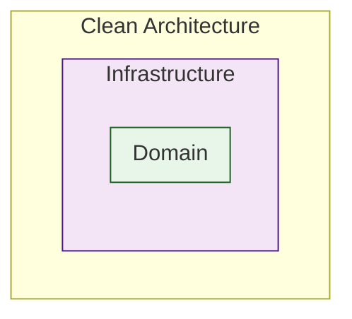
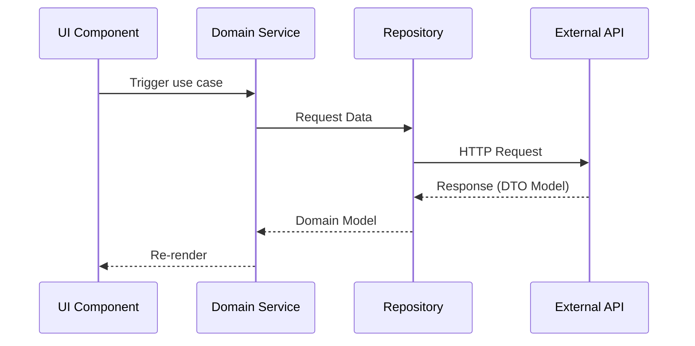

[← Back to Documentation](./DOCS.md)

# Architecture Guide

## Overview

Nextgen is a modern web application built with React, TypeScript, and Vite, following Clean Architecture principles to ensure separation of concerns and maintainability.

## Clean Architecture Principles

- Domain layer independence from external frameworks
- Unidirectional dependencies
- Clear separation of concerns
- Business logic isolation

This architecture ensures:
- Testability
- Maintainability
- Scalability
- Framework independence
- Clear separation of concerns

## Architecture Layers

### Domain Layer

The core of the application, containing business logic and rules independent of external frameworks or tools.

#### Models

- Defines core business entities (e.g., `YardCheckAsset`, `AccruedDistanceAsset`, `ReportFile`)
- Located in `src/domain/models`

- Example model structure:

```typescript
declare global {
  export type AssetType = {
    id: number;
    name?: string;
  };

  export type AssetId = {
    id: number;
    assetId?: string;
  };

  export type Asset = {
    id: number;
    assetId: string;
    idleTimeHours?: number;
    arrivedAt?: Date;
    lastReportedLandmark?: string;
    lastReportedTime?: Date;
    landmarkGroup?: string;
    landmarkType?: number;
    type?: number;
    sensors?: Sensor[];
    accruedDistance?: number;
    deviceInstallationDate?: Date;
    deviceSerialNumber?: string;
    assetType?: string;
  };

  export type YardCheckAsset = Required<
    Pick<
      Asset,
      | "id"
      | "assetId"
      | "idleTimeHours"
      | "arrivedAt"
      | "lastReportedTime"
      | "lastReportedLandmark"
      | "landmarkGroup"
      | "landmarkType"
      | "type"
      | "sensors"
    >
  >;

  export type AccruedDistanceAsset = Required<
    Pick<
      Asset,
      | "id"
      | "assetId"
      | "accruedDistance"
      | "deviceInstallationDate"
      | "deviceSerialNumber"
      | "assetType"
      | "arrivedAt"
      | "lastReportedLandmark"
    >
  >;
}
```

#### Services

Domain services implement business use cases and constitute the core business logic of the application:

- `asset.service`: Asset-related operations
- `landmark.service`: Landmark management
- `location.service`: Location handling
- `report.service`: Report generation and management
- `user.service`: User operations
- `csv.service`: CSV file handling utilities

Key characteristics:

- **Framework Independence**: 
  - Services are completely framework-agnostic
  - Business logic could be reused across different implementations
  - No dependencies on specific UI or infrastructure libraries

- **Pure Use Cases**:
  - Each method represents a specific business use case
  - Implementation focuses exclusively on business logic
  - Contains no presentation logic or infrastructure details

- **Dependency Inversion Principle**:
  - Services have no knowledge of external layers
  - Use interfaces and abstractions to communicate with infrastructure
  - No direct references to UI, database, or API implementations
  - For simplicity, we directly use repository implementations instead of defining domain interfaces, taking a more pragmatic approach to Clean Architecture while maintaining layer separation

The last point can be seen in how our services are implemented, as we can see in the example from `landmark.service.ts`:

```typescript
import { LandmarkRepository } from "@/infrastructure/repositories";

type GetLandmarksParams = {
  name?: string;
  ids?: number[];
  limit?: number;
};

export function getLandmarks({ name, ids, limit }: GetLandmarksParams): Promise<Landmark[]> {
  return LandmarkRepository.getLandmarks({ name, ids, limit });
}
```


#### Utils

Common utilities for date manipulation and other domain-specific transformations. A few examples:

- **Date Utils** (`date.utils.ts`):
  ```typescript
  // Convert ISO string to formatted date
  export function dateFormatter(date: string): string {
    const dateString = date.toLocaleDateString("en-US", { month: "2-digit", day: "2-digit", year: "numeric" });
    const timeString = date.toLocaleTimeString("en-US", { hour: "2-digit", minute: "2-digit", hour12: true });
    return `${dateString}, ${timeString}`;
  };

  // Get a human-readable label for the last reported time
  export function getLastReportedLabel(lastReported?: number) {
    if (!lastReported) return "No Last Reported";
    if (lastReported === 7) return "Last week";
    if (lastReported === 14) return "Last 2 weeks";
    if (lastReported === 21) return "Last 3 weeks";
    if (lastReported === 30) return "Last month";
    return `Last ${lastReported} days`;
  };
  // ...rest of the file
  ```

### Infrastructure Layer

Handles external concerns and implements domain interfaces.

#### Repositories

Each domain model has a corresponding repository:

```typescript
export * as AssetRepository from "./asset/asset.repository";
export * as LandmarkRepository from "./landmark/landmark.repository";
export * as LocationRepository from "./location/location.repository";
export * as ReportRepository from "./report/report.repository";
export * as UserRepository from "./user/user.repository";
```

Key features:
- API communication
- DTO validation using Zod
- Data transformation between DTOs and domain models

#### Example: Landmark Repository

The Landmark Repository demonstrates the key features of our repository pattern:

```typescript
// Repository implementation
import { apiFetch } from "@/infrastructure/api-fetch/api-fetch";
import { LandmarkDto,  LandmarkDtoSchema } from "./landmark-dto";
import { zodParseArray } from "@/infrastructure/zod-parse/zod-parse";

type GetLandmarksParams = {
  name?: string;
  ids?: number[];
  limit?: number;
};

export function getLandmarks({ name, ids, limit }: GetLandmarksParams): Promise<Landmark[]> {
  // API endpoint path
  const url = "/api/v1/landmark";

  // Build query parameters
  const params = new URLSearchParams();
  if (name) params.set("keyword", name);
  if (ids) params.set("ids", ids.join(","));
  if (limit) params.set("limit", limit.toString());

  // Fetch data from the API
  const landmarks = await apiFetch<LandmarkDto[]>(`${url}?${params.toString()}`);

  // Parse the data using Zod
  const parsedLandmarks = zodParseArray(LandmarkDtoSchema, landmarks);

  // Transform the data into the domain model
  return parsedLandmarks.map((landmark) => ({
    id: landmark.id,
    name: landmark.name,
    typeId: landmark.typeId,
    groupId: landmark.groupId,
  }));
};

export function getLandmarkTypes(): Promise<Array<LandmarkType>> {
  // API endpoint path
  const url = "/api/v1/landmark/types";

  // Fetch data from the API
  const types = await apiFetch<Array<LandmarkTypeDto>>(url);

  // Parse the data using Zod
  const parsedTypes = zodParseArray(LandmarkTypeDtoSchema, types);

  // Transform the data into the domain model
  return parsedTypes.map((type) => ({ id: type.geoTypeID, name: type.name }));
};
```

Key aspects demonstrated:

1. **DTO Definition and Validation**
```typescript
// DTO Schema using Zod
export const LandmarkDtoSchema = z
  .object({
    id: z.number(),
    name: z.string(),
    typeId: z.number().optional(),
    groupId: z.number().optional(),
  })
  .describe("LandmarkDto");
```

2. **Type Safety**
- Strong typing for parameters and return values
- DTO to domain model transformation
- Validation using Zod schemas

3. **API Communication**
- Centralized HTTP client (`apiFetch`)
- URL and query parameter handling
- Error handling through the HTTP client

4. **Data Transformation**
- Converts API DTOs to domain models
- Handles optional fields
- Maintains clean domain model structure

This repository pattern ensures:
- Separation of API and domain logic
- Consistent data validation
- Type-safe data transformations
- Centralized API communication

#### Async Operations

[TanStack Query](https://tanstack.com/query/latest) (formerly React Query) implementation for API communication provides powerful data-fetching and state management capabilities:

##### Why TanStack Query?

- **Automatic background refetching**
  - Keeps data fresh with configurable stale times
  - Smart refetching on window focus and network recovery
- **Cache management**
  - Intelligent caching with configurable cache times
  - Deduplication of requests
  - Cache invalidation and updates
- **Error handling and retries**
  - Configurable retry logic
  - Built-in error states
  - Automatic error recovery
- **Request cancellation**
  - Automatic cancellation of stale requests
  - Manual cancellation support
- **Parallel queries**
  - Efficient handling of multiple simultaneous requests
  - Data dependencies and query coordination

#### Views

Application screens implementing the UI layer:
- Uses compound components pattern with a generic Layout
- Each view corresponds to a main application screen

##### Main Views

###### 1. Yard Check (`/yard-check`)

- Default main view of the application
- Allows visualization and management of yard assets
- Key features:
  - Advanced asset filtering
  - Data grid with sorting and pagination
  - Filter panel with categories:
    - Landmark filters
    - Asset filters
    - Location filters
    - Sensor filters
    - Operational filters

###### 2. Accrued Distance (`/accrued-distance`)

- Displays information about accumulated asset distance
- Key features:
  - Simplified filtering system
  - Distance metrics visualization
  - Filter panel with categories:
    - Asset filters
    - Operational filters

###### 3. Reports (`/reports`)

- Report management hub
- Key features:
  - Report creation and scheduling
  - CSV report downloads
  - Management options:
    - View reports
    - Edit reports
    - Download reports
    - Email reports
    - Run on demand
    - Delete reports


###### 4. Error Pages (`/error/:errorCode`)

- Error handling views
- Displays custom messages based on error code
- Supported error codes:
  - 400: Bad Request
  - 401: Unauthorized
  - 403: Forbidden
  - 404: Not Found
  - 500: Server Error


#### Navigation Structure

````typescript
export const APP_LINKS = {
  left: [
    { label: "Yard Check", path: "/yard-check" },
    { label: "Accrued Distance", path: "/accrued-distance" },
  ],
  right: [{ label: "Reports", path: "/reports" }],
};
````

Navigation is organized into two sections:
- Left links: Yard Check and Accrued Distance
- Right links: Reports

All views share a common layout that includes:
- Top bar with logo and user profile
- Navigation bar with filters
- Main content area


#### State Management

The application leverages Zustand for efficient and scalable global state management. Each store is carefully organized into separate files to maintain a clean and modular structure, enabling better code organization and easier maintenance. This approach allows for:

- Isolated state logic per feature
- Improved code splitting
- Better developer experience with TypeScript integration
- Simplified testing and debugging
- Minimal boilerplate compared to traditional state management solutions

- Feature-specific stores:
  - `accrued-distance.store`
  - `yard-check.store`
  - `reports.store`

- Global UI state store:
  - `ui.store`


## Testing Strategy

### Unit Testing with Vitest

- Fast and reliable test execution
- Component and business logic testing
- Mocking capabilities
- Coverage reporting

### E2E Testing with Playwright

- Cross-browser testing
- Real user interaction simulation
- Visual regression testing
- Network request interception

## API Mocking

Uses Mock Service Worker (MSW) for API simulation:

- Transparent switching between mock and real API
- Handler-based mock implementation

## Styling Strategy

Dual approach to styling:

1. **Material UI**

- Used for complex component implementations
- Component customization
- Theme consistency

2. **TailwindCSS**

- Default choice for layout and styling
- Utility-first approach
- Custom styling needs


## Architecture Diagrams

### Layer Structure


### Data Flow

